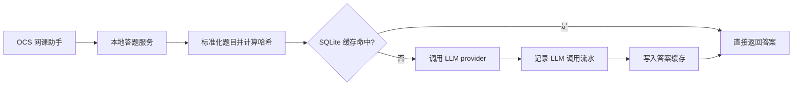

<div align="center">

# OCS LLM Answerer

面向 [OCS 网课助手](https://docs.ocsjs.com/) 自定义题库接口的 LLM 答题后端。

[](https://www.python.org/)
[](https://fastapi.tiangolo.com/)
[](https://platform.openai.com/docs/api-reference/responses)
[](https://www.sqlite.org/)
[](https://docs.astral.sh/uv/)
[](LICENSE)

把传统静态题库变成一个可以推理、可缓存、可追溯的本地优先智能题库。

</div>

> 项目处于早期阶段，当前重点是稳定 OCS 接入、LLM 答题、SQLite 缓存和请求审计链路。

## 目录

- [项目亮点](#项目亮点)
- [快速上手](#快速上手)
- [OCS 配置示例](#ocs-配置示例)
- [常用配置](#常用配置)
- [工作原理](#工作原理)
- [技术栈](#技术栈)
- [文档](#文档)
- [项目信息](#项目信息)
- [许可证](#许可证)

## 项目亮点

| 能力 | 说明 |
| --- | --- |
| OCS 兼容 | 提供答题接口和可导入的题库订阅配置。 |
| 智能回退 | 先查 SQLite 缓存，未命中再请求 LLM，避免同题重复消耗 token。 |
| 结构化输出 | 通过 OpenAI SDK 的 Responses API 和 Pydantic 解析模型答案。 |
| 请求审计 | 记录 provider、模型、原始响应、状态、耗时和 token 用量。 |
| 本地优先 | 默认监听 `127.0.0.1:8000`，密钥通过 `.env` 和环境变量管理。 |

## 快速上手

第一次使用时，按下面顺序完成配置、启动服务，然后把题库订阅地址填入 OCS。

| 步骤 | 你要做什么 | 关键结果 |
| --- | --- | --- |
| 1 | 准备 `uv` | 可以安装依赖并运行服务 |
| 2 | 复制本地配置文件 | 生成 `.env` 和 `config/providers.json` |
| 3 | 填入 LLM API Key | 服务可以调用模型 |
| 4 | 启动本地服务 | `http://127.0.0.1:8000` 可访问 |
| 5 | 在 OCS 中填写订阅地址 | OCS 可以调用本服务答题 |

### 1. 准备环境

- Python `>=3.14`
- [uv](https://docs.astral.sh/uv/) 用于依赖、运行、测试和构建
- 可访问 OpenAI Responses API 或兼容该接口的服务

### 2. 安装依赖并生成配置

```bash
uv sync
cp .env.example .env
cp config/providers.example.json config/providers.json
```

### 3. 填入模型密钥

编辑 `.env`，至少填入 provider 使用的 API Key：

```env
OPENAI_API_KEY=sk-...
```

如果你使用 OpenAI 兼容网关，可以继续编辑 `config/providers.json`，按需调整 `base_url`、`model` 和 `extra_body`。

### 4. 启动服务

```bash
uv run ocs-llm-answerer --reload
```

服务默认运行在：

```text
http://127.0.0.1:8000
```

### 5. 填入 OCS

推荐在 OCS 题库订阅地址中填写：

```text
http://127.0.0.1:8000/ocs-answerer.json
```

这个地址会返回 OCS 可直接导入的数组配置，并自动带上本服务当前的答题接口地址。若设置了 `OCS_LLM_ANSWERER_API_KEY`，订阅配置会自动包含 `X-API-Key` 请求头。

## OCS 配置示例

推荐优先使用订阅地址：

```text
http://127.0.0.1:8000/ocs-answerer.json
```

如果需要手动配置题库，可以直接参考下面的完整 JSON。注意：OCS 题库配置必须是数组。

```json
[
  {
    "name": "OCS LLM Answerer",
    "homepage": "http://127.0.0.1:8000",
    "url": "http://127.0.0.1:8000/api/v1/answer",
    "method": "post",
    "contentType": "json",
    "headers": {
      "Content-Type": "application/json",
      "X-API-Key": "change-me"
    },
    "data": {
      "title": "${title}",
      "type": "${type}",
      "options": "${options}"
    },
    "handler": "return (res)=> res.code === 1 ? [res.question, res.answer] : undefined"
  }
]
```

如果你的 OCS 环境需要油猴跨域请求模式，请在 `.env` 中设置：

```env
OCS_LLM_ANSWERER_OCS_ANSWERER_REQUEST_TYPE=GM_xmlhttpRequest
```

## 常用配置

应用配置来自 `.env` 和环境变量，provider 运行配置来自 `config/providers.json`。

```env
OCS_LLM_ANSWERER_API_KEY=
OCS_LLM_ANSWERER_DATABASE_PATH=data/cache.sqlite3
OCS_LLM_ANSWERER_PROVIDERS_CONFIG_PATH=config/providers.json
OCS_LLM_ANSWERER_OCS_ANSWERER_REQUEST_TYPE=fetch
OPENAI_API_KEY=
```

`config/providers.json` 示例：

```json
{
  "active_provider": "openai",
  "providers": {
    "openai": {
      "adapter": "openai_responses",
      "base_url": "https://api.openai.com/v1",
      "api_key_env": "OPENAI_API_KEY",
      "model": "gpt-4o-mini",
      "timeout_seconds": 30,
      "max_retries": 2,
      "extra_body": {}
    }
  }
}
```

更多配置说明见 [docs/configuration.md](docs/configuration.md)。

## 工作原理



服务启动时会初始化 SQLite schema，并根据 `config/providers.json` 创建当前启用的 LLM provider。每次答题请求都会先被标准化：题目文本会去除多余空白，选项会整理为稳定列表，然后用题目、题型和选项计算 SHA-256 哈希。缓存命中时直接返回答案；缓存未命中时请求 LLM，并把调用配置、原始响应、状态、耗时和 token 用量写入数据库。

## 技术栈

| 模块 | 技术 |
| --- | --- |
| 项目管理 | `uv` |
| Web 框架 | FastAPI、Uvicorn |
| 数据模型 | Pydantic、Pydantic Settings |
| LLM 调用 | OpenAI Python SDK、Responses API |
| 数据库 | SQLite、aiosqlite |
| 测试与质量 | pytest、ruff |
| 打包 | hatchling、uv build |

## 文档

- [配置说明](docs/configuration.md)
- [API 参考](docs/api.md)
- [开发指南](docs/development.md)

## 项目信息

| 项目 | 内容 |
| --- | --- |
| 作者 | mochenya |
| 邮箱 | 74086519+mochenya@users.noreply.github.com |
| 仓库 | <https://github.com/mochenya/ocs-llm-question> |

## 许可证

本项目使用 [MIT License](LICENSE)。
